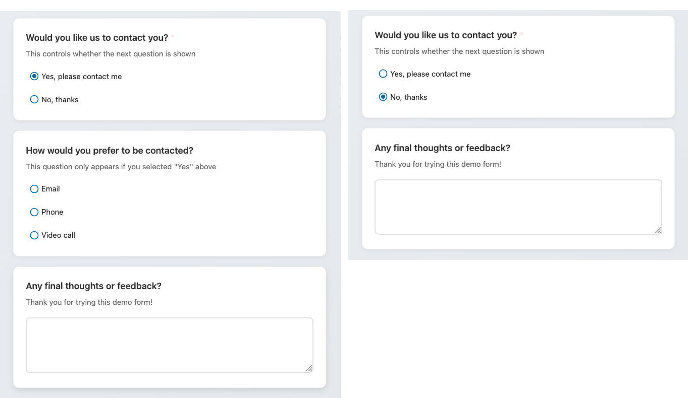

# Geavanceerde features

FormVox bevat krachtige features voor het maken van dynamische, intelligente formulieren.

## Conditionele logica

Conditionele logica laat je vragen tonen of verbergen op basis van eerdere antwoorden. Dit creëert een persoonlijke ervaring voor respondenten.



### Hoe het werkt

1. Selecteer een vraag die je conditioneel wilt tonen
2. Klik op **Conditie toevoegen** in de vraag-instellingen
3. Configureer de conditie:
   - **Als** — selecteer de vraag om te checken
   - **Operator** — gelijk aan, niet gelijk aan, bevat, enz.
   - **Waarde** — de antwoord-waarde om te matchen
4. De vraag verschijnt alleen als de conditie klopt

### Meerdere condities

Je kunt meerdere condities toevoegen met AND/OR-logica:

- **AND** — alle condities moeten waar zijn
- **OR** — een willekeurige conditie mag waar zijn

### Voorbeeld use-cases

**Klant-feedback-formulier:**

- V1: "Hoe tevreden ben je?" (schaal 1-5)
- V2: "Wat kunnen we verbeteren?" (verschijnt alleen als V1 ≤ 3)

**Event-registratie:**

- V1: "Kom je naar het diner?" (Ja/Nee)
- V2: "Dieet-voorkeuren?" (verschijnt alleen als V1 = Ja)

## Quiz-modus

Verander je formulier in een quiz met automatische scoring.


### Quiz-modus inschakelen

1. Open formulier-instellingen
2. Schakel **Quiz-modus** in
3. Markeer per vraag de correcte antwoord(en)
4. Wijs punten toe

### Scoring-opties

- **Punten per vraag** — wijs verschillende punten-waarden toe aan vragen
- **Gedeeltelijke punten** — voor multiple choice, ken gedeeltelijke punten toe
- **Slagings-drempel** — stel een minimum-score in om te slagen

### Resultaten-weergave

Na inzending kunnen respondenten zien:

- Hun totaal-score
- Correcte/incorrecte antwoorden
- Feedback per vraag (optioneel)

### Quiz-vraagtypen

Geschikte vraagtypen voor quizzes:

- Single choice (één correct antwoord)
- Multiple choice (meerdere correcte antwoorden)
- Dropdown (één correct antwoord)
- Korte tekst (exacte match)

## Answer-piping

Gebruik antwoorden van eerdere vragen in latere vragen of berichten.

### Syntax

Gebruik dubbele accolades met het vraag-ID:

```
{{question_id}}
```

### Voorbeeld

**V1:** "Wat is je naam?" → gebruiker antwoordt "Jan"

**V2:** "Hoi {{q1}}, op welke afdeling werk je?"

Wordt getoond als: "Hoi Jan, op welke afdeling werk je?"

### Waar je piping kunt gebruiken

- Vraag-tekst
- Vraag-beschrijvingen
- Pagina-titels
- Bevestigings-berichten

## Multi-page formulieren

Ordeel lange formulieren in meerdere pagina's voor een betere gebruikers-ervaring.

### Pagina's maken

1. Klik op **Pagina toevoegen** in de vragen-lijst
2. Geef de pagina een titel (optioneel)
3. Sleep vragen naar de pagina

### Pagina-navigatie

Respondenten zien:

- **Volgende**-knop om naar de volgende pagina te gaan
- **Vorige**-knop om terug te gaan
- Voortgangs-indicator (optioneel)

### Pagina-logica

Combineer pagina's met conditionele logica:

- Hele pagina's overslaan op basis van antwoorden
- Verschillende paden tonen voor verschillende gebruikers

### Conditionele pagina-routing

Conditionele pagina-routing laat je naar een specifieke pagina springen op basis van de antwoorden van een respondent. Dit is krachtiger dan simpele pagina-niveau-conditionele logica — het verandert welke pagina als volgende komt.

#### Routing-regels instellen

1. Navigeer in de editor naar de pagina waar je routing wilt toevoegen
2. Klik op de **Routing**-knop in de pagina-header
3. Klik op **Regel toevoegen** om een routing-regel te maken
4. Configureer de regel:
   - **Als vraag** — selecteer de vraag om te evalueren
   - **Operator** — kies een vergelijkings-operator
   - **Waarde** — de antwoord-waarde om te matchen (indien van toepassing)
   - **Ga naar pagina** — selecteer de doel-pagina

#### Beschikbare operators

| Operator | Beschrijving |
|----------|--------------|
| gelijk aan | Antwoord matched exact met de waarde |
| niet gelijk aan | Antwoord matched niet met de waarde |
| bevat | Antwoord bevat de waarde |
| is leeg | Antwoord is blanco (geen waarde nodig) |
| is niet leeg | Antwoord heeft een waarde (geen waarde nodig) |
| groter dan | Antwoord is numeriek groter |
| kleiner dan | Antwoord is numeriek kleiner |

#### Hoe het werkt

- Regels worden in volgorde geëvalueerd — de eerste matchende regel wint
- Als geen regel matcht, gaat het formulier door naar de volgende pagina zoals gewoonlijk
- De **Terug**-knop navigeert door het werkelijk gerouteerde pad, niet alleen het vorige pagina-nummer

#### Voorbeeld

Een tevredenheids-enquête met 4 pagina's:

- **Pagina 1**: algemene vragen (inclusief "Hoe tevreden ben je?" schaal 1-5)
- **Pagina 2**: gedetailleerde feedback (voor ontevreden gebruikers)
- **Pagina 3**: testimonial-verzoek (voor tevreden gebruikers)
- **Pagina 4**: bedankt

Routing-regels op pagina 1:

- Als "Hoe tevreden ben je?" **kleiner dan** 3 → Ga naar pagina 2
- Als "Hoe tevreden ben je?" **groter dan** 3 → Ga naar pagina 3

## Formulier-branding

Pas het uiterlijk van je formulieren aan zodat ze passen bij je organisatie.

### Branding-opties

- **Header-afbeelding** — logo of banner bovenaan
- **Achtergrond-kleur** — formulier-achtergrond
- **Accent-kleur** — knoppen en highlights
- **Custom CSS** — geavanceerde styling (alleen beheerder)

### Per-formulier branding

Elk formulier kan zijn eigen branding hebben, of overerven van organisatie-defaults.

## Duplicaten voorkomen

Voorkom dat gebruikers meerdere antwoorden indienen.

### Methodes

- **Browser-fingerprint** — detecteer dezelfde browser/device
- **Nextcloud-gebruiker** — één inzending per ingelogde gebruiker
- **E-mail-verificatie** — vereist e-mail-bevestiging

### Instellingen

1. Open formulier-instellingen
2. Onder **Inzending-instellingen**
3. Schakel duplicaten-preventie in
4. Kies de methode

## Rate limiting

Bescherm je formulieren tegen spam en misbruik.

### Bescherming voor publieke formulieren

Voor publieke formulieren:

- **Inzendingen per minuut** — limiteer snelle inzendingen
- **CAPTCHA** — bot-bescherming toevoegen (vereist admin-setup)

## Volgende stappen

- Leer over [Delen en publiceren](sharing-publishing.md)
- Bekijk en analyseer [Resultaten](results-analysis.md)
- [Exporteer je data](exporting-data.md)
