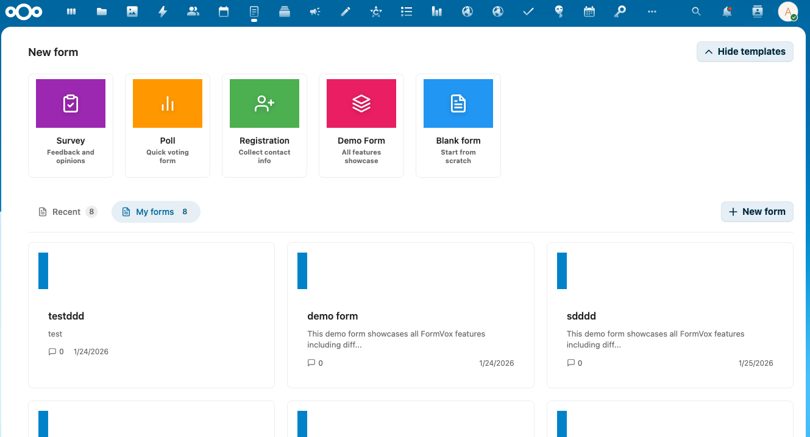

# Creating Forms

This guide explains how to create, edit, and manage forms in FormVox.

## Creating a New Form

### From the FormVox App

1. Open FormVox from the Nextcloud navigation bar
2. You'll see the template gallery on the homepage

3. Click on a template card to create a new form:
   - **Blank** - Empty form to build from scratch
   - **Survey** - Pre-configured with common survey questions
   - **Poll** - Simple voting form
   - **Registration** - Event registration template
   - **Demo** - Example form showcasing all features

4. In the dialog, configure your form:

   - **Title** - Name of your form
   - **Location** - Folder where the .fvform file will be saved

5. Click **Create** to open the form editor

### From the Files App

You can also create forms directly from Nextcloud Files:

1. Navigate to the folder where you want to create the form
2. Click the **+** button
3. Select **New form**
4. Enter a name and click Create

## The Form Editor

The form editor is divided into three sections:

### Left Sidebar - Question List
- View all questions in your form
- Drag and drop to reorder questions
- Click a question to edit it

### Center - Question Editor
- Edit the selected question
- Configure question text and options
- Preview how the question will look

### Right Sidebar - Settings
- Question settings (required, description, etc.)
- Form settings (title, description, branding)
- Submission settings

## Adding Questions

1. Click **Add question** or the **+** button
2. Choose a question type from the dropdown
3. Enter your question text
4. Configure options based on the question type

See [Question Types](question-types.md) for details on each type.

## Editing Questions

### Reordering Questions
- Drag and drop questions in the left sidebar
- Or use the up/down arrows on each question

### Duplicating Questions
- Click the duplicate icon on a question
- A copy will be created below the original

### Deleting Questions
- Click the delete icon on a question
- Confirm the deletion

## Form Settings

### General Settings
- **Title** - The form title shown to respondents
- **Description** - Optional description shown at the top of the form

### Submission Settings
- **Allow multiple submissions** - Let users submit multiple times
- **Show progress bar** - Display progress on multi-page forms
- **Confirmation message** - Custom message after submission

### Branding
- **Header image** - Add a logo or banner
- **Background color** - Customize the form appearance
- **Button color** - Match your organization's colors

## Multi-Page Forms

For longer forms, you can organize questions into pages:

1. Click **Add page** in the question list
2. Drag questions into the new page
3. Respondents will see a "Next" button between pages

## Saving Your Form

Forms are automatically saved as you edit. The form file (`.fvform`) is stored in the location you specified when creating the form.

## Next Steps

- Learn about all [Question Types](question-types.md)
- Add [Conditional Logic](advanced-features.md) to your forms
- [Share your form](sharing-publishing.md) with others
