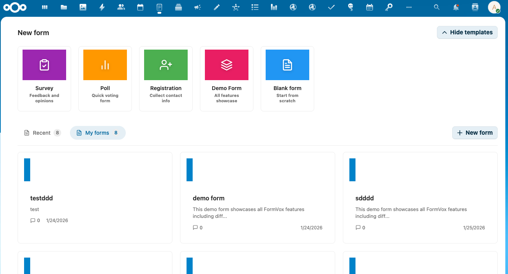
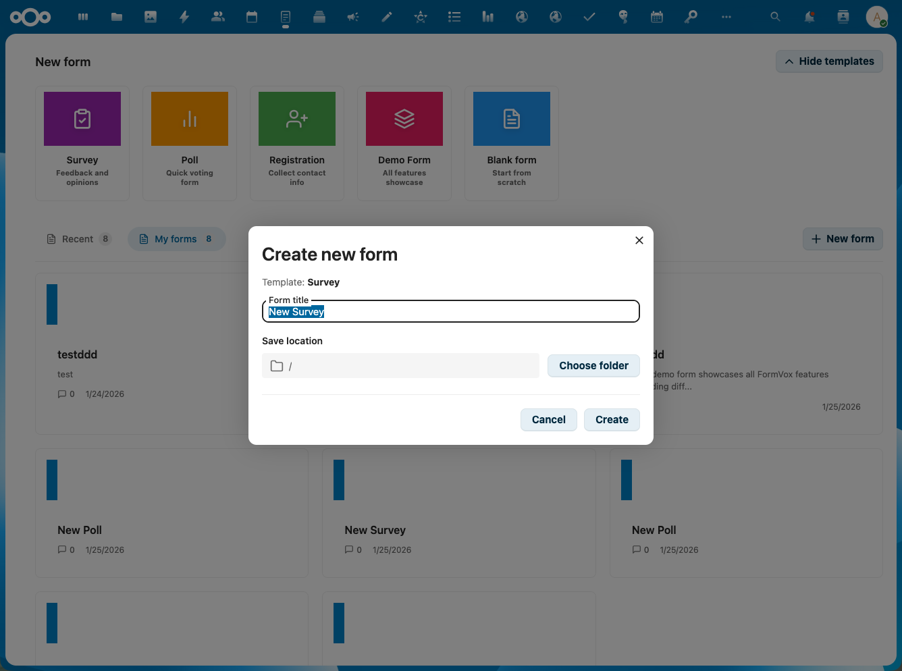
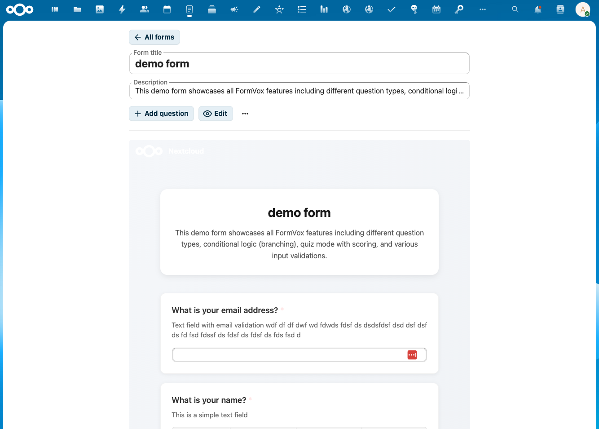

# Formulieren maken

Deze gids legt uit hoe je formulieren maakt, bewerkt en beheert in FormVox.

## Een nieuw formulier maken

### Vanuit de FormVox-app

1. Open FormVox via de Nextcloud-navigatiebalk
2. Je ziet de template-galerij op de homepage

3. Klik op een template-kaart om een nieuw formulier te maken:
   - **Blank** — leeg formulier om vanaf nul te bouwen
   - **Survey** — voorgeconfigureerd met veelgebruikte enquête-vragen
   - **Poll** — simpel stem-formulier
   - **Registration** — event-registratie-template
   - **Demo** — voorbeeld-formulier dat alle features toont

4. Configureer je formulier in het dialoogvenster:

   - **Titel** — naam van je formulier
   - **Locatie** — map waar het .fvform-bestand opgeslagen wordt

5. Klik op **Aanmaken** om de formulier-editor te openen

### Vanuit de Files-app

Je kunt ook direct formulieren aanmaken via Nextcloud Files:

1. Navigeer naar de map waar je het formulier wilt aanmaken
2. Klik op de **+**-knop
3. Selecteer **Nieuw formulier**
4. Voer een naam in en klik op Aanmaken

## De formulier-editor

De formulier-editor is verdeeld in drie secties:

### Linker-sidebar — vragen-lijst

- Bekijk alle vragen in je formulier
- Sleep om de volgorde aan te passen
- Klik op een vraag om hem te bewerken

### Midden — vraag-editor

- Bewerk de geselecteerde vraag
- Configureer vraag-tekst en opties
- Preview hoe de vraag eruit ziet

### Rechter-sidebar — instellingen

- Vraag-instellingen (verplicht, beschrijving, enz.)
- Formulier-instellingen (titel, beschrijving, branding)
- Inzending-instellingen

## Vragen toevoegen

1. Klik op **Vraag toevoegen** of de **+**-knop
2. Kies een vraagtype uit de dropdown
3. Voer je vraag-tekst in
4. Configureer opties op basis van het vraagtype

Zie [Vraagtypen](question-types.md) voor details per type.

## Vragen bewerken

### Volgorde aanpassen

- Sleep vragen in de linker-sidebar
- Of gebruik de pijl-omhoog-/omlaag-knoppen op elke vraag

### Vragen dupliceren

- Klik op het dupliceer-icoon van een vraag
- Een kopie wordt aangemaakt onder het origineel

### Vragen verwijderen

- Klik op het verwijder-icoon van een vraag
- Bevestig de verwijdering

## Formulier-instellingen

### Algemene instellingen

- **Titel** — de formulier-titel die respondenten zien
- **Beschrijving** — optionele beschrijving bovenaan het formulier

### Inzending-instellingen

- **Meerdere inzendingen toestaan** — laat gebruikers meerdere keren indienen
- **Voortgangsbalk tonen** — voortgang tonen op multi-page formulieren
- **Bevestigings-bericht** — eigen bericht na inzending

### Branding

- **Header-afbeelding** — voeg een logo of banner toe
- **Achtergrond-kleur** — pas het formulier-uiterlijk aan
- **Knop-kleur** — match met je organisatie-huisstijl

## Multi-page formulieren

Voor langere formulieren kun je vragen ordenen in pagina's:

1. Klik op **Pagina toevoegen** in de vragen-lijst
2. Sleep vragen naar de nieuwe pagina
3. Respondenten zien een "Volgende"-knop tussen pagina's

## Gezamenlijk bewerken

Wanneer meerdere gebruikers schrijf-toegang hebben tot een formulier, toont FormVox wie er nog meer aan het bewerken is.

### Aanwezigheids-indicators

- **Avatar-iconen** verschijnen in de editor-toolbar voor andere actieve editors
- Aanwezigheid wordt automatisch gedetecteerd via heartbeat-polling (elke 30 seconden)
- Editors die meer dan 60 seconden inactief zijn worden uit de lijst verwijderd

### Hoe het werkt

1. Open een formulier dat gedeeld is met schrijf-rechten
2. Als andere gebruikers ook aan het bewerken zijn, verschijnen hun avatars in de toolbar
3. Een aantal-badge verschijnt bij veel actieve editors (bv. "3 anderen bewerken")

## Concept-autosave

FormVox slaat de voortgang van respondenten automatisch op tijdens het invullen, zodat ze later verder kunnen als ze de browser sluiten of weg-navigeren.

### Hoe het werkt

- Antwoorden worden tijdens het invullen opgeslagen in de browser-localStorage
- Als een respondent terugkomt op hetzelfde formulier, verschijnt een **"Welkom terug!"**-banner
- Ze kunnen kiezen voor **Doorgaan** om verder te gaan, of **Opnieuw beginnen** om opnieuw te starten
- Concepten worden automatisch gewist na succesvolle inzending
- Concepten verlopen na **7 dagen** inactiviteit

### Opmerkingen

- Concepten worden per browser opgeslagen — een andere browser of apparaat start een nieuwe sessie
- Browser-data wissen verwijdert opgeslagen concepten
- Dit werkt zowel bij publieke als bij geauthenticeerde formulieren

## Je formulier opslaan

Formulieren worden automatisch opgeslagen tijdens het bewerken. Het formulier-bestand (`.fvform`) wordt opgeslagen op de locatie die je hebt gekozen bij het aanmaken.

## Volgende stappen

- Leer over alle [Vraagtypen](question-types.md)
- Voeg [Conditionele logica](advanced-features.md) toe aan je formulieren
- [Deel je formulier](sharing-publishing.md) met anderen
