# Vraagtypen

FormVox ondersteunt een breed scala aan vraagtypen om verschillende soorten data te verzamelen. Deze gids legt elk type uit en wanneer je het gebruikt.

## Tekst-vragen

### Korte tekst

Single-line tekst-input voor korte antwoorden zoals namen of titels.

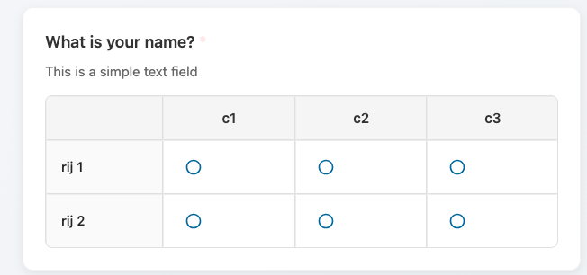

**Geschikt voor:** namen, titels, korte antwoorden
**Validatie:** optionele teken-limiet

### E-mail

Tekst-input met e-mail-validatie.

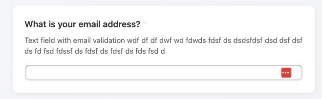

**Geschikt voor:** e-mailadressen verzamelen
**Validatie:** moet een geldig e-mail-formaat zijn

### Multi-line tekst (textarea)

Grote tekst-area voor langere antwoorden.

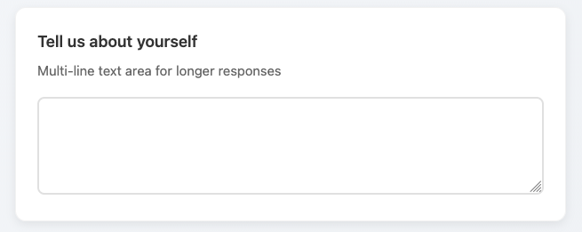

**Geschikt voor:** opmerkingen, feedback, gedetailleerde antwoorden
**Instellingen:** aanpasbaar aantal regels

## Keuze-vragen

### Single choice (radio)

Selecteer één optie uit een lijst.

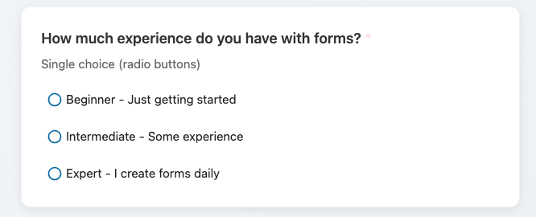

**Geschikt voor:** ja/nee-vragen, één optie kiezen
**Instellingen:**

- Opties toevoegen/verwijderen
- "Anders"-optie met tekst-input
- Optie-volgorde randomiseren

### Multiple choice (checkbox)

Selecteer meerdere opties uit een lijst.

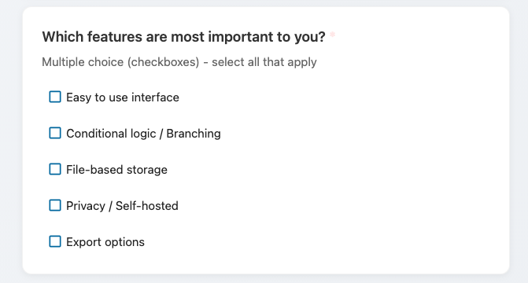

**Geschikt voor:** meerdere items selecteren, multi-select voorkeuren
**Instellingen:**

- Opties toevoegen/verwijderen
- Minimum/maximum selecties
- "Anders"-optie met tekst-input

### Dropdown-select

Selecteer één optie uit een dropdown-menu.

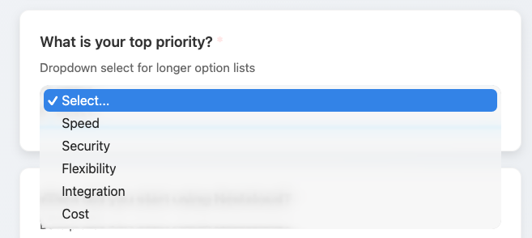

**Geschikt voor:** lange optie-lijsten, ruimte besparen
**Instellingen:** gelijk aan single choice

## Datum- en tijd-vragen

### Datum-picker

Selecteer een datum uit een kalender.

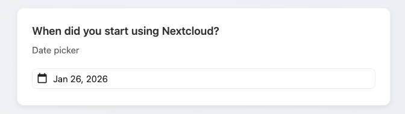

**Geschikt voor:** geboortedatums, event-datums, deadlines
**Instellingen:**

- Minimum-/maximum-datum
- Datum-formaat

### Tijd-picker

Selecteer een tijd.

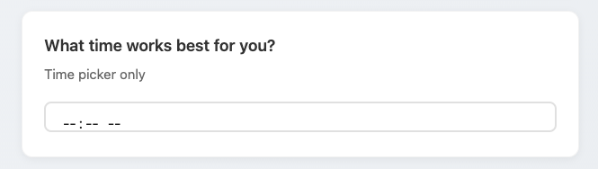

**Geschikt voor:** afspraak-tijden, planningen
**Instellingen:** 12-uurs- of 24-uurs-formaat

### DateTime-picker

Selecteer zowel datum als tijd.

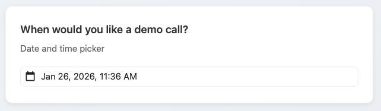

**Geschikt voor:** event-planning, afspraken met specifieke tijden

## Rating-vragen

### Lineaire schaal

Rate op een numerieke schaal (bv. 1-5, 1-10).

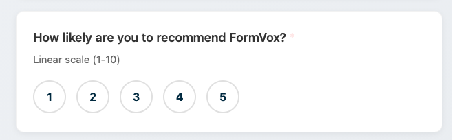

**Geschikt voor:** tevredenheids-ratings, instemmings-schalen, NPS
**Instellingen:**

- Minimum- en maximum-waarden
- Labels voor uiteinden (bv. "Niet tevreden" tot "Zeer tevreden")

### Sterren-rating

Visuele sterren-gebaseerde rating.

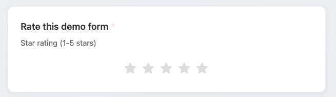

**Geschikt voor:** product-reviews, ervarings-ratings
**Instellingen:** aantal sterren (meestal 5)

## Bestand-vragen

### Bestand-upload

Sta respondenten toe bestanden te uploaden bij hun antwoord.

**Geschikt voor:** document-inzendingen, foto-uploads, bijlagen
**Instellingen:**

- Toegestane bestandstypen (bv. PDF, afbeeldingen, documenten)
- Maximum-bestandsgrootte
- Maximum-aantal bestanden

**Beveiliging:**

- Geüploade bestanden worden veilig opgeslagen in Nextcloud
- Bestanden zijn alleen toegankelijk voor de formulier-eigenaar
- Bestanden worden verwijderd wanneer het antwoord wordt verwijderd

**Let op:** bestand-uploads tellen mee voor het opslag-quotum van de formulier-eigenaar.

## Geavanceerde vragen

### Matrix

Raster van vragen met gedeelde antwoord-opties.

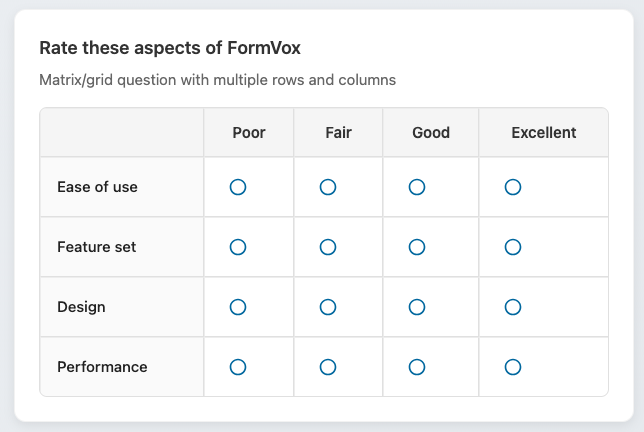

**Geschikt voor:** meerdere items raten op dezelfde schaal, opties vergelijken
**Instellingen:**

- Rij-labels (items om te raten)
- Kolom-labels (rating-opties)
- Single of multiple selectie per rij

## Vraag-instellingen

Alle vraagtypen delen gemeenschappelijke instellingen:

### Verplicht

Markeer een vraag als verplicht. Respondenten moeten antwoorden voor inzending.

### Beschrijving

Voeg helper-tekst onder de vraag toe voor extra context.

### Placeholder

Standaard-tekst getoond in lege input-velden.

### Conditionele logica

Toon of verberg de vraag op basis van eerdere antwoorden. Zie [Geavanceerde features](advanced-features.md).

### Quiz-scoring

Ken punten toe aan correcte antwoorden voor quiz-modus. Zie [Quiz-modus](advanced-features.md#quiz-modus).

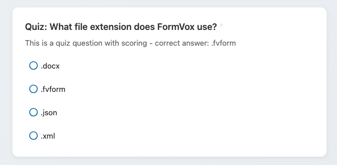

## Tips voor het kiezen van vraagtypen

| Doel | Aanbevolen type |
|------|-----------------|
| Namen/e-mails verzamelen | Korte tekst / E-mail |
| Ja/nee-vraag | Single choice |
| Meerdere selecties | Multiple choice |
| Lange lijst opties | Dropdown |
| Tevredenheids-rating | Lineaire schaal of Sterren-rating |
| Meerdere items raten | Matrix |
| Gedetailleerde feedback | Multi-line tekst |
| Afspraken plannen | DateTime-picker |
| Documenten/bestanden verzamelen | Bestand-upload |

## Volgende stappen

- Voeg [Conditionele logica](advanced-features.md) toe om dynamische formulieren te maken
- Stel [Quiz-modus](advanced-features.md#quiz-modus) in voor assessments
- Leer over het [Delen](sharing-publishing.md) van je formulieren
