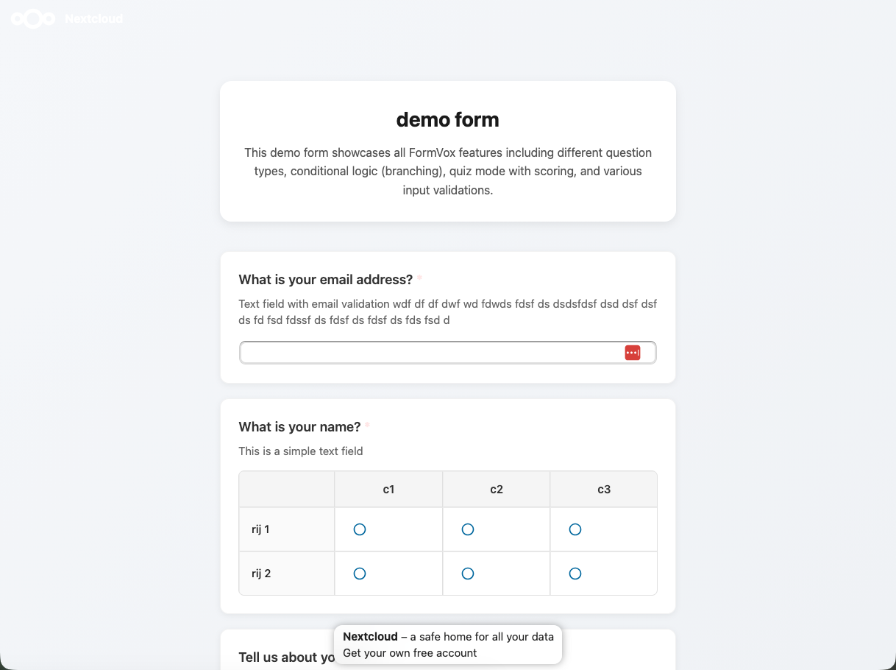

# Results and Analysis

After collecting responses, FormVox provides powerful tools to view and analyze your data.

## Accessing Results

1. Open your form in FormVox
2. Click **Results** in the toolbar
3. You'll see the results dashboard

## Results Dashboard

### Summary View

The summary view shows:
- **Total responses** - Number of submissions
- **Response rate** - If applicable
- **Average completion time** - How long respondents take

### Charts and Visualizations

For each question, FormVox displays appropriate charts:

| Question Type | Visualization |
|---------------|---------------|
| Single choice | Pie chart, bar chart |
| Multiple choice | Horizontal bar chart |
| Linear scale | Distribution chart |
| Star rating | Average with stars |
| Matrix | Heatmap |
| Text | Word cloud (optional) |

### Question-by-Question

Scroll through to see results for each question:
- Response counts
- Percentages
- Visual charts

## Individual Responses

View each submission separately:

1. Click **Individual responses** tab
2. Browse through submissions
3. Use pagination for large datasets

### Response Details

Each response shows:
- Submission date/time
- All answers
- Respondent info (if collected)

### Filtering Responses

Filter responses by:
- Date range
- Specific answers
- Completion status

## Quiz Results

For forms in quiz mode:

### Score Summary
- Average score
- Score distribution
- Pass/fail rates

### Per-Question Analysis
- Percentage correct
- Common wrong answers
- Difficulty analysis

### Individual Scores
- View each respondent's score
- See which questions they got right/wrong

## Real-Time Updates

Results update in real-time:
- New submissions appear automatically
- Charts update without refresh
- No need to reload the page

## Response Management

### Delete Responses

To delete a single response:
1. Go to **Individual responses**
2. Find the response
3. Click the delete icon
4. Confirm deletion

### Delete All Responses

To clear all data:
1. Open form settings
2. Click **Delete all responses**
3. Confirm (this cannot be undone)

### Archive Responses

Export and clear old responses:
1. Export data (see [Exporting](exporting-data.md))
2. Delete responses
3. Keep the export for records

## Notifications

Get notified of new responses:

1. Open form settings
2. Enable **Email notifications**
3. Choose notification frequency:
   - Every submission
   - Daily summary
   - Weekly summary

## Best Practices

### For Ongoing Surveys
- Check results regularly
- Export data periodically
- Watch for trends over time

### For Quizzes
- Review question performance
- Adjust questions that everyone gets wrong/right
- Use analytics to improve future quizzes

### For Large Datasets
- Use filtering to focus on segments
- Export to Excel for advanced analysis
- Create multiple forms for different groups

## Next Steps

- [Export your data](exporting-data.md) for external analysis
- Learn about [Question Types](question-types.md) to improve your forms
- Set up [Conditional Logic](advanced-features.md) based on common answers
