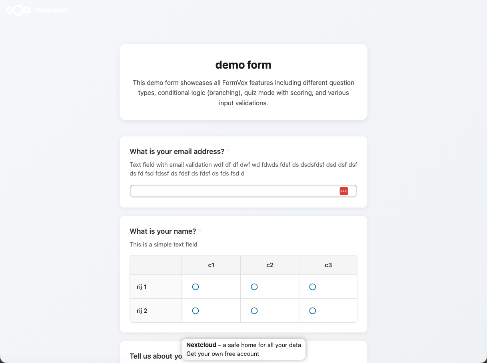

# Resultaten en analyse

Na het verzamelen van antwoorden biedt FormVox krachtige tools om je data te bekijken en analyseren.

## Resultaten openen

1. Open je formulier in FormVox
2. Klik op **Resultaten** in de toolbar
3. Je ziet het resultaten-dashboard

## Resultaten-dashboard

### Samenvattings-weergave

De samenvattings-weergave toont:

- **Totaal aantal antwoorden** — aantal inzendingen
- **Response-rate** — indien van toepassing
- **Gemiddelde voltooiingstijd** — hoe lang respondenten erover doen

### Grafieken en visualisaties

Voor elke vraag toont FormVox passende grafieken:

| Vraagtype | Visualisatie |
|-----------|--------------|
| Single choice | Taartdiagram, staafdiagram |
| Multiple choice | Horizontaal staafdiagram |
| Lineaire schaal | Distributie-grafiek |
| Sterren-rating | Gemiddelde met sterren |
| Matrix | Heatmap |
| Tekst | Word cloud (optioneel) |

### Vraag-per-vraag

Scroll door om de resultaten per vraag te zien:

- Response-aantallen
- Percentages
- Visuele grafieken

## Individuele antwoorden

Bekijk elke inzending apart:

1. Klik op het tabblad **Individuele antwoorden**
2. Blader door inzendingen
3. Gebruik paginering voor grote datasets

### Antwoord-details

Elk antwoord toont:

- Inzending-datum/tijd
- Alle antwoorden
- Respondent-info (indien verzameld)

### Antwoorden filteren

Filter antwoorden op:

- Datum-range
- Specifieke antwoorden
- Voltooiings-status

## Quiz-resultaten

Voor formulieren in quiz-modus:

### Score-samenvatting

- Gemiddelde score
- Score-distributie
- Slagings-percentages

### Per-vraag-analyse

- Percentage correct
- Veelvoorkomende foute antwoorden
- Moeilijkheids-analyse

### Individuele scores

- Bekijk de score van elke respondent
- Zie welke vragen ze goed/fout hadden

## Real-time updates

Resultaten updaten real-time:

- Nieuwe inzendingen verschijnen automatisch
- Grafieken updaten zonder refresh
- Geen pagina-reload nodig

## Antwoord-beheer

### Antwoorden verwijderen

Om één antwoord te verwijderen:

1. Ga naar **Individuele antwoorden**
2. Vind het antwoord
3. Klik op het verwijder-icoon
4. Bevestig verwijdering

### Alle antwoorden verwijderen

Om alle data te wissen:

1. Open formulier-instellingen
2. Klik op **Alle antwoorden verwijderen**
3. Bevestig (kan niet ongedaan worden gemaakt)

### Antwoorden archiveren

Oude antwoorden exporteren en wissen:

1. Exporteer data (zie [Exporteren](exporting-data.md))
2. Verwijder antwoorden
3. Bewaar de export voor archivering

## Notificaties

Krijg een melding bij nieuwe antwoorden:

1. Open formulier-instellingen
2. Schakel **E-mail-notificaties** in
3. Kies notificatie-frequentie:
   - Elke inzending
   - Dagelijks samenvatting
   - Wekelijks samenvatting

## Best practices

### Voor lopende enquêtes

- Bekijk resultaten regelmatig
- Exporteer data periodiek
- Let op trends in de tijd

### Voor quizzes

- Bekijk vraag-prestaties
- Pas vragen aan die iedereen fout/goed heeft
- Gebruik analytics om toekomstige quizzes te verbeteren

### Voor grote datasets

- Gebruik filtering om op segmenten te focussen
- Exporteer naar Excel voor geavanceerde analyse
- Maak meerdere formulieren voor verschillende doelgroepen

## Volgende stappen

- [Exporteer je data](exporting-data.md) voor externe analyse
- Leer over [Vraagtypen](question-types.md) om je formulieren te verbeteren
- Stel [Conditionele logica](advanced-features.md) in op basis van veelvoorkomende antwoorden
