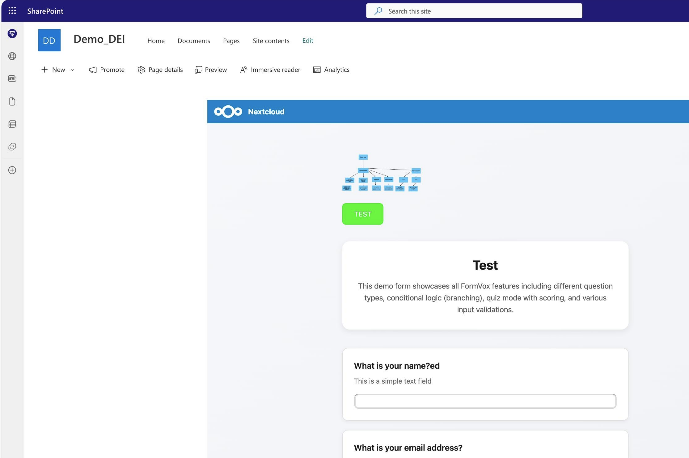

# Delen en publiceren

FormVox biedt flexibele opties voor het delen van je formulieren.

## Deel-methodes

### Delen met Nextcloud-gebruikers

FormVox is bestands-gebaseerd: elk formulier is een `.fvform`-bestand in je Files. Je
deelt een formulier dus net als elk ander bestand — via de **Files**-app, niet via het
Delen-dialoog binnen FormVox.

1. Open de **Files**-app
2. Zoek het `.fvform`-bestand op (of de map waarin je formulieren staan)
3. Open de deel-zijbalk en deel het zoals gebruikelijk met een gebruiker of groep
4. De ontvanger opent het bestand en FormVox start ermee op

Wat de ontvanger mag, volgt direct uit de Nextcloud-bestandsrechten die je geeft:

| Bestandsrecht | Rol in FormVox | Wat diegene kan |
| --- | --- | --- |
| Eigenaar | Owner | Alles, inclusief het formulier verwijderen |
| Lezen + bewerken | Editor | Vragen, instellingen, branding bewerken en antwoorden inzien |
| Alleen lezen | Viewer | Formulier openen, bekijken en een antwoord indienen |
| Deel-recht | — | Mag de publieke antwoord-link aanmaken en beheren |

De map delen waarin de formulieren staan is meestal het handigst: elk formulier dat je
erin zet, is dan automatisch mee-gedeeld.

> **Let op:** de **Share**-knop binnen FormVox deelt het formulier *niet* met andere
> Nextcloud-gebruikers. Die knop beheert de publieke antwoord-link en de bijbehorende
> instellingen. De gebruikers- en groeps-kiezers die je daar ziet, dienen twee andere
> doelen: kiezen wie een melding krijgt bij nieuwe antwoorden, en beperken wie er via
> de publieke link mag indienen (zie [Gebruikers-/groeps-beperkingen](#gebruikers-groeps-beperkingen)
> hieronder).

### Publieke links

Maak een link die iedereen kan benaderen:

1. Open je formulier
2. Klik op **Share** in de toolbar
3. Klik onder **Response link** op **Create response link** als er nog geen is
4. Configureer de opties onder **Link settings** (zie hieronder)
5. Kopieer de link, of download de QR-code

## Publieke-link-opties

### Wachtwoord-bescherming

Vereist een wachtwoord om het formulier te benaderen:

1. Open **Link settings** en schakel **Password protect** in
2. Voer een wachtwoord in en klik op **Save**
3. Deel het wachtwoord apart met de beoogde respondenten

### Vervaldatum

Stel een deadline in voor formulier-toegang:

1. Open **Link settings** en schakel **Set expiration** in
2. Kies een datum en tijd
3. Na verloop geeft de link een error terug

### Gebruikers-/groeps-beperkingen

Beperk wie een publiek formulier kan benaderen:

1. Open **Link settings** en schakel **Restrict to specific users/groups** in
2. Selecteer Nextcloud-gebruikers of -groepen
3. Alleen deze gebruikers kunnen het formulier openen en indienen (ze moeten inloggen)

Dit beperkt de toegang *via de publieke link*. Deze gebruikers krijgen het formulier
hiermee niet in hun eigen FormVox — deel daarvoor het bestand (zie hierboven).

Dit is handig voor:

- Interne enquêtes die een publiek-stijl interface nodig hebben
- Antwoorden verzamelen van specifieke afdelingen

## Formulieren embedden

Eén van FormVox' meest flexibele features is de mogelijkheid om formulieren direct te embedden in elke website of elk platform dat HTML ondersteunt. Dit betekent dat je formulieren kunnen leven waar je gebruikers al zijn — zonder ze te hoeven doorverwijzen naar een aparte pagina.

FormVox-formulieren kunnen embedded worden in:

- **Microsoft SharePoint**-sites en -pagina's
- **Bedrijfs-intranetten** en -portalen
- **WordPress**, **Drupal** of elke CMS
- **Statische websites** en landing-pages
- **Learning management systems** (LMS)
- Elk platform dat iframe-embedding ondersteunt


*Een FormVox-formulier dat naadloos draait binnen een SharePoint-site — volledig interactief, inclusief alle vraagtypen, conditionele logica en bestand-uploads.*

Omdat FormVox standaard iframe-embedding gebruikt, werkt het overal waar HTML ondersteund wordt. Het embedded formulier is volledig functioneel: respondenten kunnen alle vraagtypen invullen, door conditionele logica navigeren, bestanden uploaden en indienen — allemaal zonder de host-pagina te verlaten.

### De embed-code-generator gebruiken

De makkelijkste manier om een formulier te embedden:

1. Open je formulier
2. Klik op **Share** in de toolbar
3. Open de sectie **Advanced** en zoek **Embed code**
4. Configureer opties:
   - **Breedte** — vaste pixels of responsive (100%)
   - **Hoogte** — frame-hoogte in pixels
5. Kopieer de gegenereerde embed-code
6. Plak in de HTML van je website

De generator produceert klaar-voor-gebruik code — geen handmatige aanpassingen nodig.

### Handmatige iframe-embed

Als je liever de embed-code zelf schrijft:

```html
<iframe
  src="https://your-nextcloud.com/apps/formvox/public/FORM_HASH"
  width="100%"
  height="600"
  frameborder="0">
</iframe>
```

### Responsive embed

Voor mobile-friendly embedding dat zich aanpast aan elke scherm-grootte:

```html
<div style="position: relative; padding-bottom: 75%; height: 0; overflow: hidden;">
  <iframe
    src="https://your-nextcloud.com/apps/formvox/public/FORM_HASH"
    style="position: absolute; top: 0; left: 0; width: 100%; height: 100%;"
    frameborder="0">
  </iframe>
</div>
```

### SharePoint-embedding

Om een FormVox-formulier in SharePoint te embedden:

1. Genereer de embed-code via **Advanced → Embed code** in het Delen-dialoog
2. Bewerk je pagina in SharePoint
3. Voeg een **Embed**-webpart toe (of **Script Editor**)
4. Plak de iframe-code
5. Sla op en publiceer de pagina

Het formulier verschijnt inline op je SharePoint-pagina, volledig gestyled en interactief.

### Domein-beperkingen

Beheerders kunnen beperken welke domeinen formulieren mogen embedden. Als embedden niet werkt, neem contact op met je Nextcloud-beheerder om je domein toe te staan.

Zie [Beheer-configuratie](../admin/configuration.md) voor details.

## QR-code

FormVox kan een QR-code genereren voor elke publieke-formulier-link, wat het makkelijk maakt om formulieren te delen in print-materialen, presentaties of op schermen.

### Een QR-code genereren

1. Open je formulier
2. Klik op **Share** in de toolbar
3. Maak een antwoord-link aan (indien nog niet aanwezig)
4. De QR-code wordt automatisch gegenereerd en getoond in het Delen-dialoog

### De QR-code downloaden

1. Klik op **QR-code downloaden** onder de QR-code-afbeelding
2. De QR-code wordt opgeslagen als PNG-bestand
3. De bestandsnaam bevat de formulier-titel voor makkelijke identificatie

### Use-cases

- Drukken op posters of flyers voor event-registratie
- Tonen op slides tijdens presentaties
- Opnemen in e-mail-handtekeningen of nieuwsbrieven
- Plaatsen op fysieke locaties (receptie-balies, leslokalen)

## File-based delen

Omdat FormVox formulieren als bestanden opslaat, kun je ook delen via:

### Nextcloud-bestand-delen

1. Ga naar de Files-app
2. Vind je `.fvform`-bestand
3. Deel het zoals elk ander bestand

### Formulieren kopiëren/verplaatsen

Kopieer een formulier om een duplicaat te delen:

1. Klik in Files-app rechts op het `.fvform`-bestand
2. Selecteer **Kopiëren** of **Verplaatsen**
3. Kies de doel-map

Dit maakt een onafhankelijke kopie met eigen antwoorden.

## Samenwerking

### Meerdere editors

Bij delen met bewerk-rechten:

- Meerdere gebruikers kunnen het formulier bewerken
- Wijzigingen worden automatisch opgeslagen
- Conflicten worden afgehandeld door Nextcloud's file-locking

### View-only delen

Voor formulieren met gevoelige vragen:

1. Deel alleen met **Bekijken**-permissie
2. Gebruikers kunnen de formulier-structuur zien maar niet bewerken
3. Ze kunnen nog steeds antwoorden indienen

## Best practices

### Voor interne enquêtes

- Deel met Nextcloud-groepen
- Gebruik gebruikers-beperkingen op publieke links
- Schakel "één inzending per gebruiker" in

### Voor externe enquêtes

- Gebruik publieke links
- Voeg wachtwoord-bescherming toe
- Stel vervaldatums in
- Schakel rate limiting in

### Voor gevoelige data

- Deel alleen met specifieke gebruikers
- Gebruik wachtwoord-bescherming
- Raadpleeg [Beveiligings-instellingen](../admin/security.md)

## Volgende stappen

- Bekijk en analyseer [Resultaten](results-analysis.md)
- [Exporteer je data](exporting-data.md)
- Configureer [Beveiligings-instellingen](../admin/security.md)
